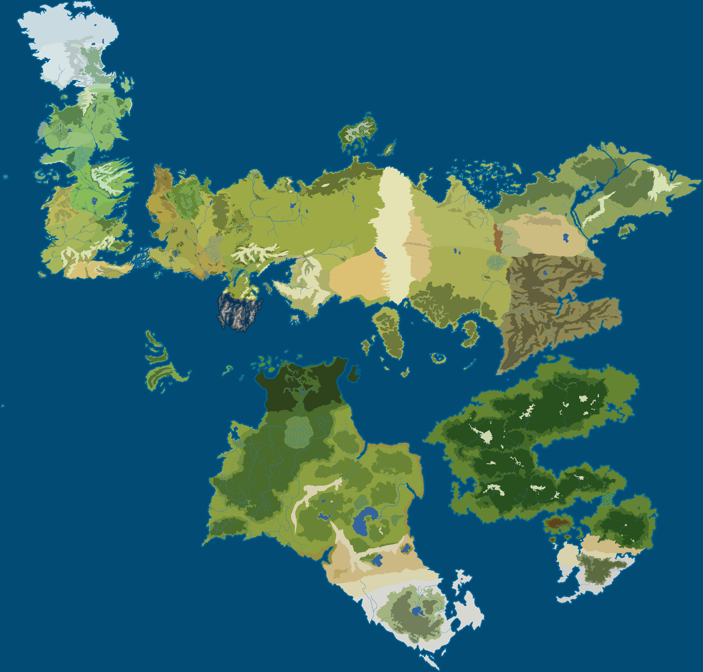

 

[![Badge License]][License]   
![Badge Contributions]

 
 
 

![Logo]

 
 

[![Button Curse]][Curse]   
[![Button Wiki]][Wiki]

 
 

 
 

## Project Status

Since I went to university, I don't have much time  
to develop the mod. So, anyone can download this  
source code or assets and modify it.

I would be grateful if you would share me your  
developments based on my code - what if your  
work is so good to enter the official version?

 

<!----------------------------------------------------------------------------->

[License]: LICENSE
[Curse]: https://www.curseforge.com/minecraft/mc-mods/gotminecraftmod
[Logo]: src/main/resources/assets/got/logo.png
[Wiki]: https://gotminecraftmod.fandom.com/ru/wiki/%D0%9C%D0%BE%D0%B4_%22%D0%98%D0%B3%D1%80%D0%B0_%D0%BF%D1%80%D0%B5%D1%81%D1%82%D0%BE%D0%BB%D0%BE%D0%B2%22_%D0%B4%D0%BB%D1%8F_Minecraft_%D0%B2%D0%B8%D0%BA%D0%B8

<!----------------------------------[ Badges ]--------------------------------->

[Badge Contributions]: https://img.shields.io/badge/Contributions-Welcome-3d6c23.svg?style=for-the-badge&labelColor=569A31
[Badge License]: https://img.shields.io/badge/License-GPL_3-0167a0.svg?style=for-the-badge&labelColor=blue

<!---------------------------------[ Buttons ]--------------------------------->

[Button Curse]: https://img.shields.io/badge/CurseForge-f16436.svg?style=for-the-badge&logoColor=white&logo=CurseForge
[Button Wiki]: https://img.shields.io/badge/Wiki-FA005A.svg?style=for-the-badge&logoColor=white&logo=Fandom